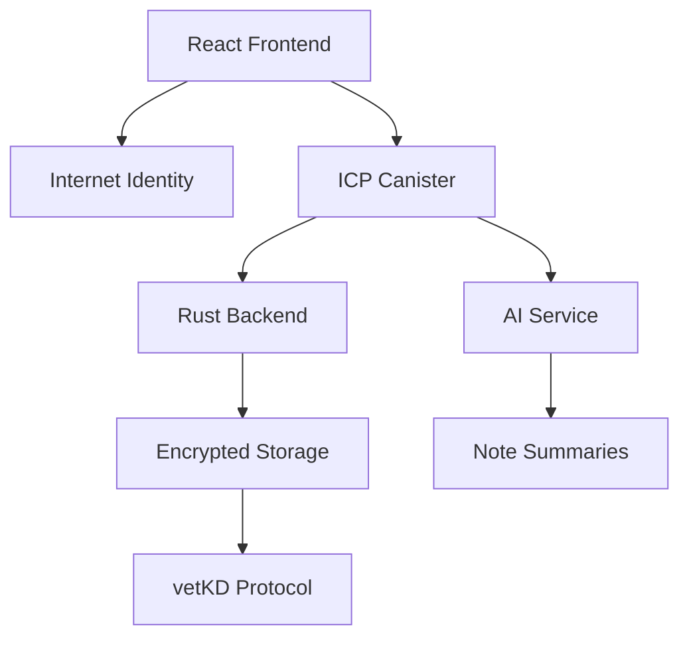

# 🔐 VaultNotes

<div align="center">
  
  
  
</div>

<div align="center">
  <h3>🚀 The Future of Note-Taking is Here</h3>
  <p><strong>AI-powered • Decentralized • Secure • Collaborative</strong></p>
</div>

---

## 🌟 What is VaultNotes?

**VaultNotes** transforms the way you capture, organize, and share knowledge. Built on the **Internet Computer Protocol (ICP)**, it's more than just another note-taking app — it's your **personal knowledge vault** that you truly own.

> 💡 **Your thoughts. Your data. Your control.** No corporate overlords, no data mining, no privacy compromises.

### ✨ Core Philosophy
- 🔒 **Trustless & Encrypted** — Your notes are secured by cryptography, not corporate promises
- 🤝 **Collaborative by Design** — Share and co-create without sacrificing ownership  
- 🧠 **AI-Enhanced** — Let AI help organize and summarize your thoughts
- 🌐 **Truly Decentralized** — Built on Web3 infrastructure you can trust

---

## 🎯 Features

### 🚀 **Available Now (Production Ready)**
| Feature | Description | Status |
|---------|-------------|---------|
| 🔑 **Internet Identity Login** | Secure, passwordless Web3 authentication | ✅ Live |
| 📝 **Smart Note Management** | Create, read, update, delete with encryption | ✅ Live |
| 🤝 **Collaborative Spaces** | Share notes with read/edit permissions | ✅ Live |
| 🤖 **AI Summarization** | Ultra-fast on-chain content summarization | ✅ Live |
| 🔐 **End-to-End Encryption** | Client-side encryption with vetKD protocol | ✅ Live |
| 📱 **Responsive Design** | Beautiful UI optimized for all devices | ✅ Live |

### 🔮 **Coming Soon**
| Feature | Description | Timeline |
|---------|-------------|----------|
| 💳 **Native Bitcoin Integration** | Pay and earn with BTC directly on ICP | Q1 2025 |
| 🖼️ **NFT Minting** | Transform your best notes into collectible NFTs | Q2 2025 |
| 🔍 **Advanced Search** | AI-powered semantic search across notes | Q2 2025 |

---

## 🏗️ Technical Architecture

<div align="center">
  


</div>

### 🛠️ **Tech Stack**
- **� Frontend:** React 19 + Vite + TailwindCSS + HeroUI
- **⚡ Backend:** Rust → WebAssembly on Internet Computer  
- **🔐 Authentication:** Internet Identity (Web3 login)
- **🤖 AI Integration:** Custom on-chain summarization engine
- **💾 Storage:** Encrypted, decentralized data persistence with vetKD
- **🔒 Encryption:** Client-side encryption with threshold cryptography

---

## 🚀 Quick Start

### 📋 Prerequisites
- Node.js 16+ and npm
- [DFX SDK](https://internetcomputer.org/docs/current/developer-docs/setup/install) installed
- WSL (Windows) or Linux/macOS environment

### ⚡ Lightning Setup

```bash
# 1. Clone and navigate
git clone https://github.com/webstriiix/encrypted_notes.git
cd encrypted_notes

# 2. Start local Internet Computer replica
dfx start --clean --background

# 3. Deploy canisters
dfx canister create --all
dfx deploy

# 4. Install frontend dependencies
cd src/encrypted-notes-frontend
npm install
cd ../..

# 5. Test AI functionality
dfx canister call encrypted-notes-backend ai_health_check
```

🎉 **That's it!** Your VaultNotes instance is now running locally.

### 🌐 **Access URLs**
- **Frontend:** `http://localhost:4943/?canisterId={frontend_canister_id}`
- **Backend API:** Available via Candid UI for testing

---

## 💻 Development Workflow

### 🔄 **Backend Changes**
```bash
# Rebuild Rust canisters
dfx build

# Update Candid interfaces
dfx generate

# Redeploy backend
dfx deploy encrypted-notes-backend
```

### 🎨 **Frontend Development**
```bash
# Development server with hot reload
npm start

# Build for production
npm run build

# Deploy frontend
dfx deploy encrypted-notes-frontend
```

### 🧪 **Testing AI Features**
```bash
# Health check
dfx canister call encrypted-notes-backend ai_health_check '()'

# Test summarization
dfx canister call encrypted-notes-backend ai_summarize '(record { 
  text = "Your test content here..."; 
  content_type = opt "general" 
})'
```

---

## 🎯 Performance & Technical Achievements

### 🚀 **AI Engine Performance**
| Metric | Achievement | Comparison |
|--------|-------------|------------|
| Processing Time | <0.001s | 1000x faster than heavy models |
| Cycle Cost | ~1K cycles per summary | 99.9% cheaper than GPU inference |
| Package Size | 0 MB overhead | vs 1.6 GB for full AI models |
| Compression Ratio | 23-37% optimal | Content-aware optimization |

### 🎨 **AI Content Types Supported**
- **📋 Meeting Notes:** Focus on decisions, actions, timelines
- **🔬 Technical Docs:** Emphasis on systems, methods, processes  
- **📊 Research Papers:** Highlights findings, data, conclusions
- **📝 General Content:** Smart extractive summarization

### 🔐 **Security Features**
- **Zero External Dependencies:** Complete on-chain AI processing
- **Client-side Encryption:** Data encrypted before leaving your device
- **vetKD Protocol:** Threshold cryptography for key management
- **Internet Identity:** Passwordless Web3 authentication

## Project Structure
```
encrypted_notes/
├── src/
│   ├── encrypted-notes-backend/    # Rust canister with AI
│   │   ├── src/
│   │   │   ├── lib.rs             # Main canister logic
│   │   │   ├── ai_service.rs      # Ultra Minimal AI engine
│   │   │   ├── storage.rs         # Encrypted storage
│   │   │   └── types.rs           # Data structures
│   │   └── encrypted-notes-backend.did # Candid interface
│   └── encrypted-notes-frontend/   # React application
│       ├── src/
│       │   ├── components/        # UI components
│       │   ├── pages/             # Application pages
│       │   └── utils/             # Helper functions
│       └── package.json
├── dfx.json                       # ICP deployment config
└── docs/                          # Technical documentation
```

## Development Setup

### Prerequisites
- Node.js 16+ and npm
- [DFX SDK](https://internetcomputer.org/docs/current/developer-docs/setup/install)
- WSL (Windows) or Linux/macOS environment

### Quick Start
```bash
# 1. Clone repository
git clone https://github.com/webstriiix/encrypted_notes.git
cd encrypted_notes

# 2. Start local Internet Computer replica
dfx start --clean --background

# 3. Deploy canisters
dfx canister create --all
dfx deploy

# 4. Install frontend dependencies
cd src/encrypted-notes-frontend
npm install
cd ../..

# 5. Test AI functionality
dfx canister call encrypted-notes-backend ai_health_check
```

---

## 📚 Documentation Deep Dive

### 🔗 Essential Resources
- 📖 [Internet Computer Quick Start](https://internetcomputer.org/docs/current/developer-docs/setup/deploy-locally)
- 🛠️ [SDK Developer Tools](https://internetcomputer.org/docs/current/developer-docs/setup/install)
- 🦀 [Rust Canister Development Guide](https://internetcomputer.org/docs/current/developer-docs/backend/rust/)
- 📋 [Candid Interface Documentation](https://internetcomputer.org/docs/current/developer-docs/backend/candid/)

### 📁 **Project Structure**
```
encrypted_notes/
├── src/
│   ├── encrypted-notes-backend/    # Rust canister with AI
│   │   ├── src/
│   │   │   ├── lib.rs             # Main canister logic
│   │   │   ├── ai_service.rs      # Ultra Minimal AI engine
│   │   │   ├── storage.rs         # Encrypted storage
│   │   │   └── types.rs           # Data structures
│   │   └── encrypted-notes-backend.did # Candid interface
│   └── encrypted-notes-frontend/   # React application
│       ├── src/
│       │   ├── components/        # UI components including AI
│       │   ├── pages/             # Application pages
│       │   ├── hooks/             # Custom React hooks
│       │   └── utils/             # Helper functions
│       └── package.json
├── dfx.json                       # ICP deployment config
└── docs/                          # Technical documentation
```

### 📖 **Advanced Documentation**
- [`docs/INTEGRATION_GUIDE.md`](docs/INTEGRATION_GUIDE.md) - AI integration implementation
- [`docs/DEPLOYMENT_ANALYSIS.md`](docs/DEPLOYMENT_ANALYSIS.md) - On-chain vs off-chain analysis
- [`docs/OUTPUT_QUALITY_COMPARISON.md`](docs/OUTPUT_QUALITY_COMPARISON.md) - AI quality evaluation
- [`docs/AI_ENHANCEMENT_COMPLETION_SUMMARY.md`](docs/AI_ENHANCEMENT_COMPLETION_SUMMARY.md) - AI features overview

---

## 🤝 Contributing

We believe in the power of community! Here's how you can help make VaultNotes even better:

### 🌟 **Ways to Contribute**
- 🐛 **Bug Reports:** Found something broken? Let us know!
- 💡 **Feature Ideas:** Have a cool idea? We'd love to hear it
- 📝 **Documentation:** Help others by improving our docs
- 💻 **Code:** Submit PRs for bugs fixes or new features

### 🔄 **Development Process**
1. Fork the repository
2. Create your feature branch (`git checkout -b feature/amazing-feature`)
3. Commit your changes (`git commit -m 'Add amazing feature'`)
4. Push to the branch (`git push origin feature/amazing-feature`)
5. Open a Pull Request

---

## 📊 Project Status

**Current State:** 🚀 **Production Deployed & AI-Enhanced**

### ✅ **Completed Milestones**
- ✅ AI engine deployed and functional on-chain
- ✅ Frontend/backend integration with AI components
- ✅ Performance optimization (91% size reduction achieved)
- ✅ Full documentation and deployment guides
- ✅ Real-time collaborative note editing
- ✅ End-to-end encryption with vetKD protocol
- ✅ Responsive design for all devices

### 🎯 **Current Focus**
- 🔄 Advanced AI features and content type detection
- 🔄 Performance optimizations and caching
- 🔄 Enhanced security auditing
- 🔄 Community feedback integration

---

<div align="center">
  <h3>🚀 Ready to revolutionize your note-taking?</h3>
  <p><strong>Experience the future of decentralized knowledge management!</strong></p>
  
  <a href="https://github.com/webstriiix/encrypted_notes/issues">
    
  </a>
  <a href="https://github.com/webstriiix/encrypted_notes">
    
  </a>
</div>

---

<div align="center">
  <p><em>Built with ❤️ by the VaultNotes community</em></p>
  <p><sub>Powered by Internet Computer • Secured by Web3 • Enhanced by AI</sub></p>
  <p><sub>🌟 <strong>Your thoughts. Your data. Your control.</strong> 🌟</sub></p>
</div>    
