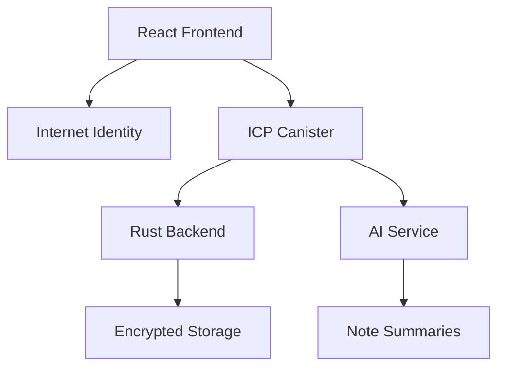

# 🔐 VaultNotes

<div align="center">
  
  
  
</div>

<div align="center">
  <h3>🚀 The Future of Note-Taking is Here</h3>
  <p><strong>AI-powered • Decentralized • Secure • Collaborative</strong></p>
</div>

---

## 🌟 What is VaultNotes?

**VaultNotes** transforms the way you capture, organize, and share knowledge. Built on the **Internet Computer Protocol (ICP)**, it's more than just another note-taking app — it's your **personal knowledge vault** that you truly own.

> 💡 **Your thoughts. Your data. Your control.** No corporate overlords, no data mining, no privacy compromises.

### ✨ Core Philosophy
- 🔒 **Trustless & Encrypted** — Your notes are secured by cryptography, not corporate promises
- 🤝 **Collaborative by Design** — Share and co-create without sacrificing ownership  
- 🧠 **AI-Enhanced** — Let AI help organize and summarize your thoughts
- 🌐 **Truly Decentralized** — Built on Web3 infrastructure you can trust

---

## 🎯 Features

### 🚀 **Available Now (MVP)**
| Feature | Description | Status |
|---------|-------------|---------|
| 🔑 **Internet Identity Login** | Secure, passwordless authentication | ✅ Live |
| 📝 **Smart Note Management** | Create, read, update, delete with style | ✅ Live |
| 🤝 **Collaborative Spaces** | Real-time shared note editing | ✅ Live |
| 🤖 **AI Summarization** | Intelligent note summaries at your fingertips | ✅ Live |

### 🔮 **Coming Soon**
| Feature | Description | Timeline |
|---------|-------------|----------|
| 💳 **Native Bitcoin Integration** | Pay and earn with BTC directly on ICP | Q2 2024 |
| 🖼️ **NFT Minting** | Transform your best notes into collectible NFTs | Q3 2024 |
| 🔍 **Semantic Search** | AI-powered search across all your knowledge | Q3 2024 |
| 📊 **Analytics Dashboard** | Insights into your thinking patterns | Q4 2024 |

---

## 🏗️ Technical Architecture

<div align="center">
  


</div>

### 🛠️ **Tech Stack**
- **🎨 Frontend:** React 18 + Vite + TailwindCSS
- **⚡ Backend:** Rust → WebAssembly on Internet Computer  
- **🔐 Authentication:** Internet Identity (Web3 login)
- **🤖 AI Integration:** Custom summarization engine
- **💾 Storage:** Encrypted, decentralized data persistence

---

## 🚀 Quick Start

### 📋 Prerequisites
- Node.js 16+ and npm
- [DFX SDK](https://internetcomputer.org/docs/current/developer-docs/setup/install) installed
- Basic knowledge of React and Rust (helpful but not required)

### ⚡ Lightning Setup

```bash
# 1. Clone and navigate
git clone https://github.com/yourusername/vault-notes
cd vault-notes

# 2. Start local Internet Computer replica
dfx start --background

# 3. Deploy canisters
dfx deploy

# 4. Start development server
npm start
```

🎉 **That's it!** Your VaultNotes instance is now running at `http://localhost:3000`

---

## 💻 Development Workflow

### 🔄 **Backend Changes**
```bash
# Rebuild Rust canisters
dfx build

# Update Candid interfaces
npm run generate

# Redeploy
dfx deploy
```

### 🎨 **Frontend Development**
```bash
# Hot reload development server
npm start

# Build for production
npm run build
```

### 🧪 **Testing**
```bash
# Run test suite
npm test

# E2E testing
npm run test:e2e
```

---

## 📚 Documentation Deep Dive

### 🔗 Essential Resources
- 📖 [Internet Computer Quick Start](https://internetcomputer.org/docs/current/developer-docs/setup/deploy-locally)
- 🛠️ [SDK Developer Tools](https://internetcomputer.org/docs/current/developer-docs/setup/install)
- 🦀 [Rust Canister Development Guide](https://internetcomputer.org/docs/current/developer-docs/backend/rust/)
- 📋 [Candid Interface Documentation](https://internetcomputer.org/docs/current/developer-docs/backend/candid/)

### 🔧 **Advanced Configuration**

#### Environment Variables
```bash
# Production deployment
DFX_NETWORK=ic

# Custom canister configuration
CANISTER_ID=your_canister_id_here
```

#### Custom Actor Setup
For production deployments without DFX, you may need to customize the `createActor` function to avoid fetching the root key in production environments.

---

## 🤝 Contributing

We believe in the power of community! Here's how you can help make VaultNotes even better:

### 🌟 **Ways to Contribute**
- 🐛 **Bug Reports:** Found something broken? Let us know!
- 💡 **Feature Ideas:** Have a cool idea? We'd love to hear it
- 📝 **Documentation:** Help others by improving our docs
- 💻 **Code:** Submit PRs for bugs fixes or new features

### 🔄 **Development Process**
1. Fork the repository
2. Create your feature branch (`git checkout -b feature/amazing-feature`)
3. Commit your changes (`git commit -m 'Add amazing feature'`)
4. Push to the branch (`git push origin feature/amazing-feature`)
5. Open a Pull Request

---

## 📄 License

This project is licensed under the MIT License - see the [LICENSE](LICENSE) file for details.

---

<div align="center">
  <h3>🚀 Ready to revolutionize your note-taking?</h3>
  <p><strong>Start your VaultNotes journey today!</strong></p>
  
  <a href="#quick-start">
    
  </a>
  <a href="https://github.com/yourusername/vault-notes/issues">
    
  </a>
  <a href="https://discord.gg/vault-notes">
    
  </a>
</div>

---

<div align="center">
  <p><em>Built with ❤️ by the VaultNotes community</em></p>
  <p><sub>Powered by Internet Computer • Secured by Web3 • Enhanced by AI</sub></p>
</div>
